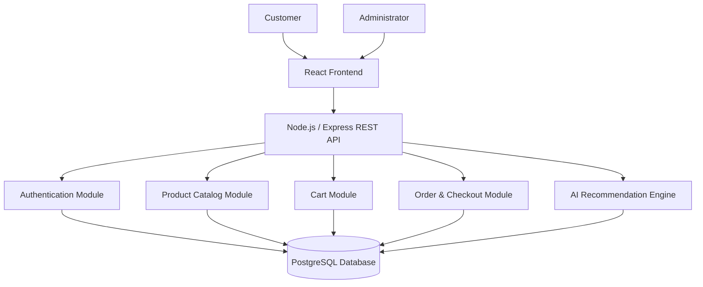

# Sprint 1: System Architecture & Scope

## Project Title

**StyleAI — AI-Powered Personalized Outfit Shopping Platform**

## Course

**E-Commerce**

## Sprint

**Sprint 1 — System Architecture & Scope**

---

# 1. Target Audience & Market Focus

## 1.1 Primary Persona

The primary users of StyleAI are **retail consumers, particularly young adults and university students who purchase clothing and fashion accessories online**.

The representative user is a customer who wants to purchase a complete outfit but may have difficulty deciding which clothing items, shoes, bags, and accessories complement each other. The user can provide preferences such as occasion, style, preferred color, and budget, and the system will recommend a suitable combination of products.

### Example User Persona

**Name:** Sara
**Age:** 21
**Occupation:** University Student
**Shopping Goal:** Find a complete outfit for a specific occasion within a limited budget.

Sara wants to attend a wedding and needs a complete traditional outfit. Instead of searching separately for a dress, shoes, bag, and accessories, she can enter her preferences into StyleAI and receive a personalized outfit recommendation.

---

## 1.2 Core Pain Point

Online fashion stores provide customers with a large number of individual products, but customers may have difficulty determining which products match each other.

The core problem addressed by StyleAI is:

> **Customers often spend considerable time searching for individual fashion products and may be uncertain about whether different products are stylistically compatible or whether a complete outfit fits their budget.**

StyleAI addresses this problem by providing an **AI-assisted outfit recommendation system** that analyzes user preferences and product attributes to recommend compatible fashion items as a complete outfit.

---

## 1.3 Domain Scope

StyleAI operates within the **online fashion and apparel e-commerce domain**.

The initial product scope includes:

* Dresses
* Tops
* Bottoms
* Shoes
* Bags
* Jewelry
* Accessories

Products will contain attributes that can be used by the recommendation system, including:

* Product category
* Color
* Style
* Occasion
* Season
* Price
* Gender
* Availability

The initial system focuses on **outfit discovery, product shopping, cart management, and order processing**. Advanced capabilities such as virtual try-on and image-based outfit generation are considered future enhancements rather than MVP requirements.

---

# 2. Minimum Viable Product (MVP) Feature Scope

The MVP will focus on five primary workflows that provide a complete e-commerce experience while introducing the project's main AI recommendation functionality.

## 2.1 MVP Feature Scope Matrix

| Category       | Feature Name                       | Description                                                                                                                                                 | Priority   |
| -------------- | ----------------------------------- | ------------------------------------------------------------------------------------------------------------------------------------------------------------ | ---------- |
| Authentication | User Registration & Authentication | Users can create accounts, log in, log out, and access authenticated features. Passwords will be securely hashed and JWT-based authentication will be used. Each user is assigned a `role` (`customer` or `admin`) that determines access to administrative features. | High (MVP) |
| Catalog        | Product Browsing & Search          | Users can browse fashion products, search by product name, view product details, and filter products by category and relevant attributes.                   | High (MVP) |
| AI Stylist     | Personalized Outfit Recommendation | The recommendation engine analyzes user preferences such as occasion, style, color, and budget and ranks compatible products to generate a complete outfit. | High (MVP) |
| Cart           | Cart & Outfit Management           | Users can add individual products or recommended outfit items to their cart, modify quantities, and remove products.                                        | High (MVP) |
| Checkout       | Order Processing                   | Users can review their cart, provide checkout information, complete a mock payment process, and create an order containing the selected products.           | High (MVP) |

### Optional Administrative Feature

| Category | Feature Name                   | Description                                                                                                 | Priority |
| -------- | ------------------------------- | ------------------------------------------------------------------------------------------------------------- | -------- |
| Admin    | Product & Inventory Management | Users with the `admin` role can create, update, and delete products and manage product stock and categories. | Medium   |

---

## 2.2 Core User Workflow

The main StyleAI workflow is:

```text
User Registration/Login
        |
        v
Browse Fashion Catalog
        |
        v
Enter Styling Preferences
        |
        v
AI Recommendation Engine
        |
        v
Personalized Complete Outfit
        |
        v
Add Products to Cart
        |
        v
Checkout
        |
        v
Order Confirmation
```

### AI Recommendation Workflow

The recommendation component will use product attributes and user preferences to calculate compatibility.

The initial recommendation factors include:

* Occasion
* Style
* Preferred color
* Budget
* Product category
* Product availability

A conceptual recommendation score can be represented as:

```text
Recommendation Score =
    Occasion Compatibility
    + Style Compatibility
    + Color Compatibility
    + Budget Compatibility
    + Product Rating
```

The products with the highest compatibility scores will be prioritized when constructing the recommended outfit.

The recommendation system will initially use a **content/attribute-based recommendation approach**. More advanced machine-learning and computer-vision techniques can be considered in later development phases.

---

# 3. Tech Stack Selection & Justification

## 3.1 Frontend Framework

### Selected Technology: React

React will be used to develop the frontend interface of StyleAI. Its component-based architecture is suitable for reusable components such as product cards, navigation menus, shopping carts, filters, recommendation panels, and administrative interfaces. React also provides a suitable foundation for managing the interactive user experience required by an e-commerce application.

**Alternative considered:** Vue.js

React was selected because of its large ecosystem and suitability for developing component-based web applications.

---

## 3.2 Backend Infrastructure

### Selected Technology: Node.js with Express.js

Node.js with Express.js will provide the server-side application and REST API for StyleAI. The backend will manage authentication, products, categories, shopping carts, orders, administrative operations, and communication between the frontend, database, and recommendation engine.

Route-level authorization middleware will check the authenticated user's `role` before granting access to admin-only endpoints (e.g., product and inventory management), so the admin panel is not merely a UI convention but is enforced at the API layer.

Node.js provides an efficient environment for I/O-intensive web applications, while Express.js provides a lightweight framework for implementing REST APIs.

**Alternative considered:** Django

Node.js/Express was selected because it allows the project team to use JavaScript across both the frontend and backend and provides a large ecosystem of packages for authentication, API development, and web application development.

---

## 3.3 Database Management System

### Selected Technology: PostgreSQL

PostgreSQL will be used as the primary relational database management system.

The application contains strongly related entities such as users, products, categories, orders, order items, carts, and cart items. A relational database is therefore appropriate for enforcing primary-key and foreign-key constraints and maintaining consistency between related records.

**Alternative considered:** MongoDB

PostgreSQL was selected instead of MongoDB because the project requires a structured relational schema and involves transactional operations such as checkout and order creation.

---

## 3.4 Caching & Asynchronous Processing

### Selected Technology: Not included in the MVP

Redis or another caching system will not be required for the initial MVP.

The project will first focus on implementing the core e-commerce functionality and recommendation engine. Caching or asynchronous processing may be introduced in future versions if the application requires optimization for frequently accessed products, recommendation results, notifications, or background tasks.

---

## 3.5 System Architecture

The proposed high-level architecture is:



### Architecture Components

**React Frontend**

Provides the user interface for:

* Registration and login
* Product browsing
* Product search
* AI styling preferences
* Outfit recommendations
* Shopping cart
* Checkout
* Order information
* Administrative operations (visible only to users with the `admin` role)

**Node.js/Express Backend**

Provides the application's business logic, REST APIs, and role-based access control for admin-only operations.

**PostgreSQL Database**

Stores users, products, categories, orders, order items, carts, and cart items.

**AI Recommendation Engine**

Processes user preferences and product attributes to generate compatible outfit recommendations.

---

# 4. Entity-Relationship Diagram (ERD)

## 4.1 Database Entities

The relational database will contain the following core entities:

1. Users
2. Categories
3. Products
4. Orders
5. Order_Items
6. Cart
7. Cart_Items

---

## 4.2 Entity Relationships

The major relationships are:

* One **User** can place many **Orders**.
* One **User** has one active **Cart**.
* One **Order** contains one or more **Order_Items**.
* One **Product** can appear in many **Order_Items**.
* One **Category** can contain many **Products**.
* One **Cart** contains many **Cart_Items**.
* One **Product** can appear in many **Cart_Items**.

The many-to-many relationships between Orders and Products and between Carts and Products are resolved using the associative entities **Order_Items** and **Cart_Items**.

---

## 4.3 Mermaid ERD

```mermaid
erDiagram

    USERS ||--o{ ORDERS : places
    USERS ||--|| CART : owns

    CATEGORIES ||--o{ PRODUCTS : contains

    ORDERS ||--|{ ORDER_ITEMS : contains
    PRODUCTS ||--o{ ORDER_ITEMS : included_in

    CART ||--o{ CART_ITEMS : contains
    PRODUCTS ||--o{ CART_ITEMS : added_to

    USERS {
        INTEGER id PK
        VARCHAR(100) name
        VARCHAR(150) email UK
        VARCHAR(255) password_hash
        VARCHAR(20) role
        TIMESTAMP created_at
        TIMESTAMP updated_at
    }

    CATEGORIES {
        INTEGER id PK
        VARCHAR(100) name UK
        TEXT description
        TIMESTAMP created_at
    }

    PRODUCTS {
        INTEGER id PK
        INTEGER category_id FK
        VARCHAR(150) name
        TEXT description
        DECIMAL(10,2) price
        VARCHAR(50) color
        VARCHAR(50) style
        VARCHAR(50) occasion
        VARCHAR(50) season
        VARCHAR(30) gender
        INTEGER stock_quantity
        VARCHAR(500) image_url
        TIMESTAMP created_at
        TIMESTAMP updated_at
    }

    ORDERS {
        INTEGER id PK
        INTEGER user_id FK
        DECIMAL(10,2) total_amount
        VARCHAR(30) status
        VARCHAR(255) shipping_address
        TIMESTAMP created_at
        TIMESTAMP updated_at
    }

    ORDER_ITEMS {
        INTEGER id PK
        INTEGER order_id FK
        INTEGER product_id FK
        INTEGER quantity
        DECIMAL(10,2) unit_price
    }

    CART {
        INTEGER id PK
        INTEGER user_id FK
        TIMESTAMP created_at
        TIMESTAMP updated_at
    }

    CART_ITEMS {
        INTEGER id PK
        INTEGER cart_id FK
        INTEGER product_id FK
        INTEGER quantity
    }
```

---

## 4.4 Entity Attribute Specifications

### USERS

| Attribute     | Data Type    | Key/Constraint   | Description                                             |
| ------------- | ------------ | ---------------- | -------------------------------------------------------- |
| id            | INTEGER      | PK               | Unique user identifier                                   |
| name          | VARCHAR(100) | NOT NULL         | User's name                                               |
| email         | VARCHAR(150) | UNIQUE, NOT NULL | User email address                                        |
| password_hash | VARCHAR(255) | NOT NULL         | Hashed user password                                      |
| role          | VARCHAR(20)  | NOT NULL, DEFAULT `customer` | Access level: `customer` or `admin`; used for route-level authorization |
| created_at    | TIMESTAMP    | NOT NULL         | Account creation time                                      |
| updated_at    | TIMESTAMP    | NOT NULL         | Last account update                                        |

---

### CATEGORIES

| Attribute   | Data Type    | Key/Constraint   | Description                |
| ----------- | ------------ | ---------------- | -------------------------- |
| id          | INTEGER      | PK               | Unique category identifier |
| name        | VARCHAR(100) | UNIQUE, NOT NULL | Category name               |
| description | TEXT         | NULL             | Category description        |
| created_at  | TIMESTAMP    | NOT NULL         | Category creation time      |

---

### PRODUCTS

| Attribute      | Data Type     | Key/Constraint | Description               |
| -------------- | ------------- | -------------- | -------------------------- |
| id             | INTEGER       | PK             | Unique product identifier   |
| category_id    | INTEGER       | FK             | References CATEGORIES(id)  |
| name           | VARCHAR(150)  | NOT NULL       | Product name                |
| description    | TEXT          | NULL           | Product description         |
| price          | DECIMAL(10,2) | NOT NULL       | Product price                |
| color          | VARCHAR(50)   | NOT NULL       | Product color                 |
| style          | VARCHAR(50)   | NOT NULL       | Product style                  |
| occasion       | VARCHAR(50)   | NOT NULL       | Suitable occasion               |
| season         | VARCHAR(50)   | NULL           | Suitable season                  |
| gender         | VARCHAR(30)   | NOT NULL       | Target customer category          |
| stock_quantity | INTEGER       | NOT NULL       | Available stock                    |
| image_url      | VARCHAR(500)  | NULL           | Product image location              |
| created_at     | TIMESTAMP     | NOT NULL       | Product creation time                |
| updated_at     | TIMESTAMP     | NOT NULL       | Last product update                   |

The `color`, `style`, `occasion`, `season`, and related attributes provide structured information that can be used by the AI recommendation engine.

---

### ORDERS

| Attribute        | Data Type     | Key/Constraint | Description             |
| ----------------- | ------------- | -------------- | ------------------------- |
| id                | INTEGER       | PK             | Unique order identifier    |
| user_id           | INTEGER       | FK             | References USERS(id)        |
| total_amount      | DECIMAL(10,2) | NOT NULL       | Total order value            |
| status            | VARCHAR(30)   | NOT NULL       | Order status (see allowed values below) |
| shipping_address  | VARCHAR(255)  | NOT NULL       | Delivery address               |
| created_at        | TIMESTAMP     | NOT NULL       | Order creation time             |
| updated_at        | TIMESTAMP     | NOT NULL       | Last order update                |

**Allowed values for `status`:** `pending`, `confirmed`, `shipped`, `delivered`, `cancelled`.

---

### ORDER_ITEMS

| Attribute  | Data Type     | Key/Constraint | Description                    |
| ---------- | ------------- | -------------- | -------------------------------- |
| id         | INTEGER       | PK             | Unique order item identifier      |
| order_id   | INTEGER       | FK             | References ORDERS(id)              |
| product_id | INTEGER       | FK             | References PRODUCTS(id)             |
| quantity   | INTEGER       | NOT NULL       | Quantity ordered                     |
| unit_price | DECIMAL(10,2) | NOT NULL       | Product price at time of order        |

`ORDER_ITEMS` acts as an associative entity between `ORDERS` and `PRODUCTS`. Storing `unit_price` here (rather than only referencing `PRODUCTS.price`) preserves the price the customer actually paid, even if the product's price changes later.

---

### CART

| Attribute  | Data Type | Key/Constraint | Description            |
| ---------- | --------- | -------------- | ------------------------ |
| id         | INTEGER   | PK             | Unique cart identifier    |
| user_id    | INTEGER   | FK, UNIQUE     | References USERS(id)       |
| created_at | TIMESTAMP | NOT NULL       | Cart creation time          |
| updated_at | TIMESTAMP | NOT NULL       | Last cart update             |

The unique constraint on `user_id` supports the one-to-one relationship between a user and their active cart.

---

### CART_ITEMS

| Attribute  | Data Type | Key/Constraint | Description                 |
| ---------- | --------- | -------------- | ------------------------------ |
| id         | INTEGER   | PK             | Unique cart item identifier      |
| cart_id    | INTEGER   | FK             | References CART(id)               |
| product_id | INTEGER   | FK             | References PRODUCTS(id)            |
| quantity   | INTEGER   | NOT NULL       | Quantity currently in cart           |

`CART_ITEMS` acts as an associative entity between `CART` and `PRODUCTS`.

---

# 4.5 Relationship Cardinality

| Relationship           | Cardinality | Explanation                                |
| ----------------------- | ----------- | -------------------------------------------- |
| USERS → ORDERS          | 1:N         | One user can place many orders                |
| USERS → CART            | 1:1         | One user has one active cart                    |
| CATEGORIES → PRODUCTS   | 1:N         | One category can contain many products           |
| ORDERS → ORDER_ITEMS    | 1:N         | One order contains one or more order items         |
| PRODUCTS → ORDER_ITEMS  | 1:N         | One product can appear in many order items          |
| CART → CART_ITEMS       | 1:N         | One cart can contain many cart items                  |
| PRODUCTS → CART_ITEMS   | 1:N         | One product can appear in many carts                   |

Therefore:

```text
ORDERS ↔ PRODUCTS
      N:M
      ↓
ORDER_ITEMS
```

and:

```text
CART ↔ PRODUCTS
     N:M
     ↓
CART_ITEMS
```

The associative entities resolve these many-to-many relationships while maintaining a normalized relational structure.

---

# 5. MVP Scope Boundaries

To ensure that the project remains feasible within the academic semester, the following features are included in the MVP:

### Included

* User registration and login (with role-based access for admin vs. customer)
* Product catalog
* Product search and filtering
* Product details
* AI-assisted outfit recommendation
* Shopping cart
* Checkout
* Order creation
* Basic product/inventory management

### Excluded from MVP

The following features are considered future enhancements:

* Virtual try-on
* Body-shape detection
* Computer-vision-based clothing recognition
* AI-generated clothing designs
* Real-time video styling
* Advanced conversational AI stylist
* Social media integration
* Real-money payment processing
* Delivery tracking integration

These features may be considered after the core MVP has been successfully implemented.

---

# 6. Future Enhancement Scope

After completion of the MVP, StyleAI can be extended with additional intelligent features.

### 6.1 Image-Based Recommendations

Users could upload an image of an existing clothing item, and the system could recommend products that visually complement it.

### 6.2 Virtual Try-On

A future version could allow users to visualize selected clothing items on an uploaded photograph.

### 6.3 Personalized User Profiles

The recommendation engine could learn from:

* Previous purchases
* Product views
* Wishlist items
* Cart activity
* Product ratings

This could allow recommendations to become more personalized over time.

### 6.4 AI Fashion Assistant

A conversational interface could allow users to ask questions such as:

> "Suggest a traditional outfit for a wedding within Rs. 15,000."

The assistant could then recommend products available in the store.

---

# 7. Sprint 1 Summary

StyleAI is an AI-assisted fashion e-commerce platform designed to simplify outfit selection and online shopping.

The system combines a conventional e-commerce architecture with a recommendation engine. Users can browse products and provide preferences such as occasion, style, color, and budget. The recommendation engine then identifies compatible products and presents them as a personalized outfit.

The MVP consists of authentication, product catalog management, AI outfit recommendations, cart management, and checkout/order processing. Role-based access control (`customer` vs. `admin`) governs who can perform inventory management. The proposed architecture uses React for the frontend, Node.js with Express.js for backend services, PostgreSQL for relational data storage, and an attribute-based recommendation engine for personalized outfit generation.

The proposed architecture and relational data model establish the technical foundation for subsequent development sprints.
